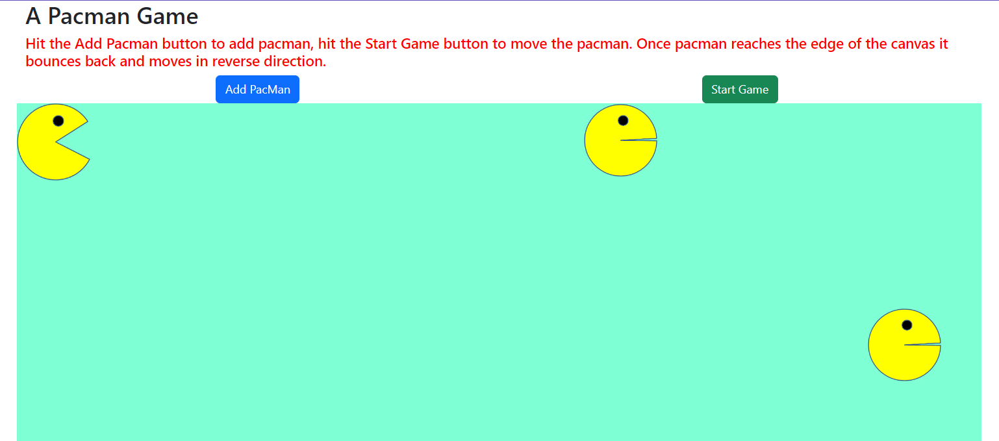

# Pacman-Game

      

        <h2>A Pacman Game</h2>
        <small class="text-muted" style="font:red">
          Hit the Add button to add pacman, hit the start button to move the
          pacman. Once pacman reaches the edge of the canvas it bounces back and
          moves in reverse direction.
        </small>
      

      
